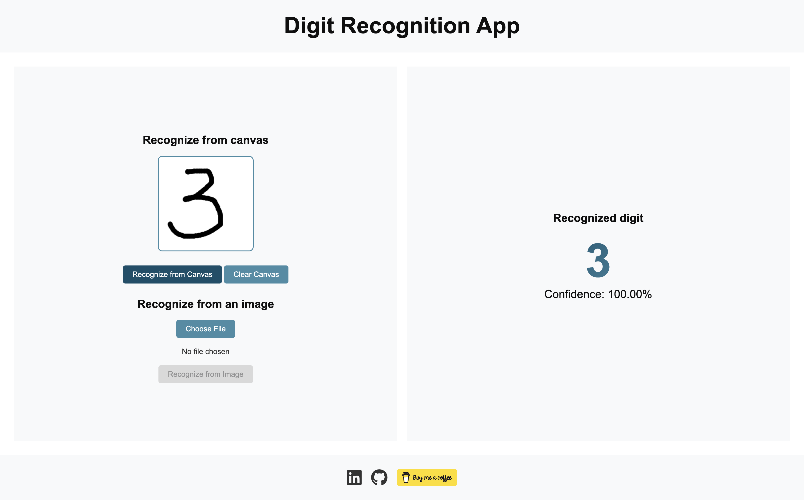

# Digit Recognition App

This is a simple Django web application that can recognize digits either drawn on a canvas or uploaded as a `.png` image with a white background. The app uses a neural network trained on the [MNIST dataset](http://yann.lecun.com/exdb/mnist/), built using Keras and TensorFlow.

You can try the live demo here: [Digit Recognition App on Heroku](https://digits-recognition-3731384318ce.herokuapp.com/)



## Features

- **Draw on Canvas**: Users can draw digits directly on a canvas, and the app will predict the **digit** (not numbers).
- **Upload PNG Images**: Users can upload `.png` images with black digits on a white background, and the app will attempt to recognize the digit.
- **Responsive Design**: The UI is simple and responsive, though it can be improved with more advanced design elements in future iterations.

### Limitations
- Only supports recognition of digits from images with a white background.
- Accuracy is not optimal and could be improved with better model tuning, better architecture, preprocessing techniques and a diverse dataset.

## Installation and Setup

### Prerequisites
- Python 3.8+
- Django 3.x
- Keras
- TensorFlow (backend for Keras)
- Virtualenv or similar for managing dependencies

### Setup Instructions

1. **Clone the repository:**
    ```bash
    git clone https://github.com/techieirina/digits_recognition_project.git
    cd digits_recognition_project
    ```

2. **Create a virtual environment and activate it:**
    ```bash
    python -m venv env
    source env/bin/activate   # On Windows use `env\Scripts\activate`
    ```

3. **Install dependencies:**
    ```bash
    pip install -r requirements.txt
    ```

4. **Run database migrations:**
    ```bash
    python manage.py migrate
    ```

5. **Run the development server:**
    ```bash
    python manage.py runserver
    ```

6. **Access the app locally:**
    Open your browser and go to:
    ```
    http://127.0.0.1:8000/
    ```

## Model Overview

The app uses a neural network trained on the [MNIST dataset](http://yann.lecun.com/exdb/mnist/) using **Keras** with a **TensorFlow** backend. The MNIST dataset consists of 28x28 grayscale images of handwritten digits. The current model is simple and suitable for recognizing isolated digits on plain backgrounds.

## How to Test the App

After running the development server, you can:

- Draw a digit on the canvas and click the "Recognize" button to get a prediction.
- Upload a `.png` image with a single black digit on a white background for recognition.
- Check the app’s responses for different digits and see how well it recognizes them.

## Tech Stack

- **Backend**: Django, Python
- **Frontend**: HTML, JavaScript, CSS
- **Machine Learning**: Keras, TensorFlow
- **Dataset**: [MNIST (handwritten digit dataset)](http://yann.lecun.com/exdb/mnist/)

## License

This project is licensed under the MIT License. See the [LICENSE](LICENSE) file for details.

## Contact

For any questions or further inquiries, feel free to reach out:

- **GitHub**: [techieirina](https://github.com/techieirina)
- **Email**: techie.irina@gmail.com
